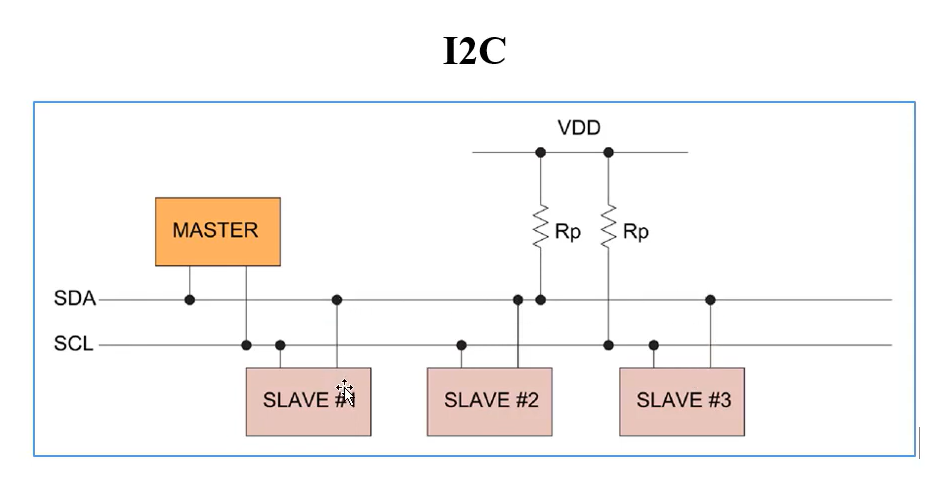
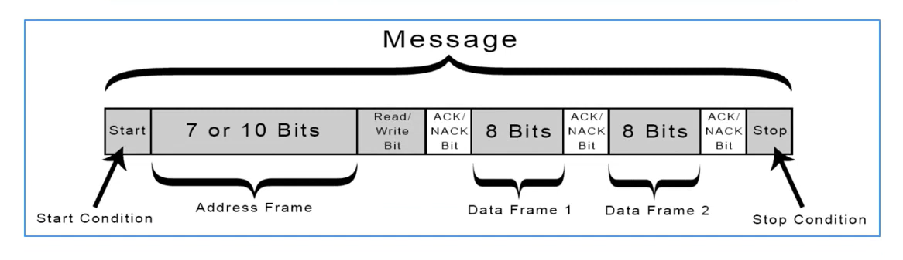

# I2C protocol 

I2C là một giao thức truyền thông nối tiếp đồng bộ, sử dụng 2 dây tín hiệu để kết nối giữa các vi điều khiển và các thiết bị ngoại vi

## Đặc điểm của I2C

- Sử dụng 2 dây tín hiệu: `SDA` - Serial Data và `SCL` - Serial Clock
- Giao tiếp kiểu Master - Slave: 1 thiết bị Master điều khiển `bus` I2C và giao tiếp với các Slave
- Hỗ trợ nhiều thiết bị trên cùng một `bus`: mỗi thiết bị slave có một địa chỉ riêng biệt
- Tốc đọ truyền dữ liệu thấp: tốc độ truyền dữ liệu tiêu chuẩn là 100 kbps, 400 kbps và 1mbps
- Đơn giản và dễ sử dụng (hơn so với SPI)

### Sơ đồ đấu nối

Cần có 2 điện trở kéo lên (Pull up resistor)

### Gói tin 

Tóm tắt các thành phần của gói tin:
- Điều kiện bắt đầu, điều kiện kết thúc
- Địa chỉ của slave (address frame)
- Bit xác định đọc/ghi
- Bit phản hồi Có/Không của slave cần giao tiếp
- Và các Data cần truyền

Ghi chú: Do chỉ có 1 đường dây `SDA` để truyền nhận dữ liệu, nên trong gói tin, phần màu xám là tín hiệu từ Master gửi đi, phần màu trắng là tín hiệu phản hồi từ slave

Các slave không giao tiếp trực tiếp với nhau
Các slave sẽ giao tiếp với Master thông qua địa chỉ (7 hoặc 10 bits)

