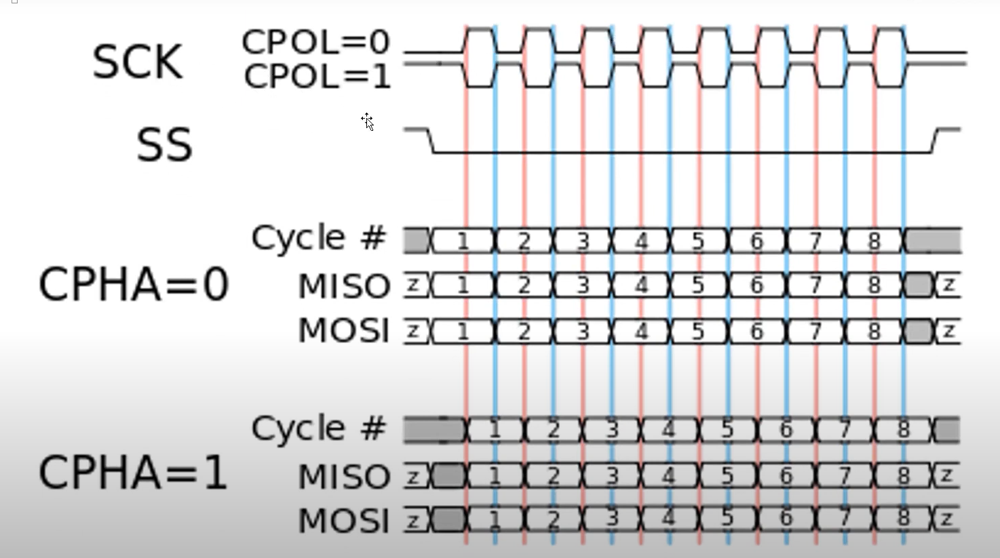
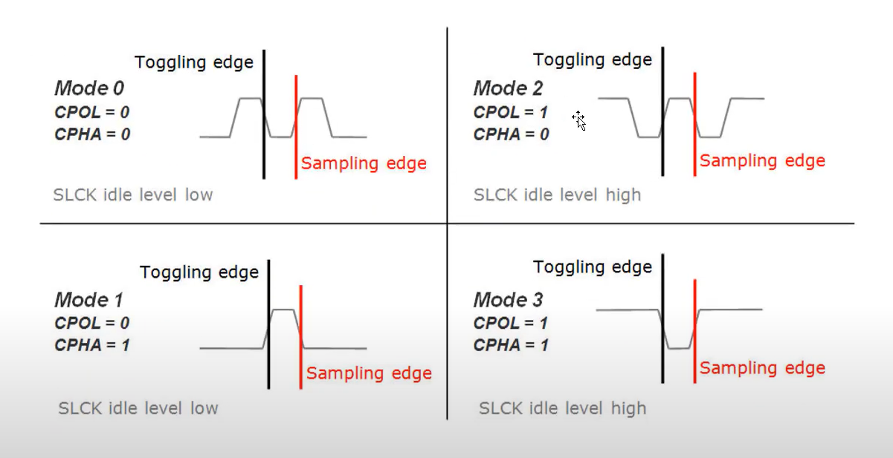
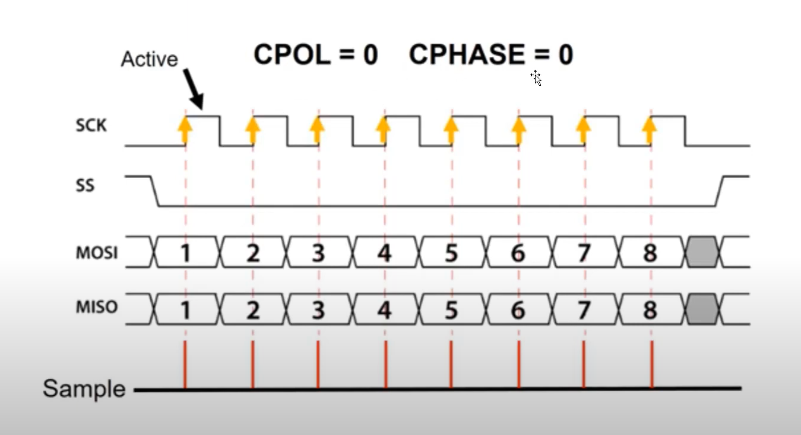

# SPI - Serial Peripheral Interface

SPI - Serial Peripheral Interface: là "giao diện ngoại vi nối tiếp đồng bộ". Giao thức SPI cho phép truyền dữ liệu nhanh chóng và tin cậy giữa các thiết bị trong hệ thống điện tử.

## Đặc điểm: 

- Truyền dữ liệu đồng bộ: dữ liệu được truyền theo từng bit, đồng bộ với xung nhịp SCK
- Kết nối đơn giản: Chỉ cần 4 chân tín hiệu chung cho tất cả các thiết bị
    - MOSI (Master out Slave in): Master truyền Slave nhận
    - MISO (Master in Slave out):  Master nhận Slave truyền
    - SCK (Serial Clock): Xung nhịp đồng hồ cho quá trình truyền nhận
    - SS (Slave Select): Chọn Slave cụ thể để giao tiếp
- Hỗ trợ nhiều thiết bị: Master có thể giao tiếp với nhiều Slave trên cùng một bus SPI
- Tốc độ truyền dữ liệu cao: Tùy thuộc vào phần cứng và cấu hình SPI có thể đạt tới tốc độ lên đến hàng MB trên giây

## Ứng dụng:

- SPI được sử dụng rộng rãi trong các hệ thống nhúng để kết nối với nhiều loại thiết bị ngoại vi, bao gồm:

    - Bộ nhớ flash: Thẻ nhớ SD, EEPROM, SPI Flash.
    - Cảm biến: Cảm biến nhiệt độ, gia tốc kế, con quay hồi chuyển.
    - Bộ mã hóa/giải mã: ADC, DAC.
    - Màn hình LCD: Màn hình LCD đồ họa, màn hình OLED.
    - Thiết bị ngoại vi khác: RFID, Bluetooth, WiFi.

## Lập trình SPI:

Cách thức lập trình SPI sẽ tùy thuộc vào vi điều khiển và ngôn ngữ lập trình, tuy nhiên các bước cơ bản đều tương tự nhau:

### 1. Khởi tạo

Cấu hình các thông số SPI bao gồm: 
- Tốc độ baudrate
- Chế độ Master/slave
- Xung nhịp SCK

### 2. Chọn Slave

- Sử dụng chân `SS` để chọn Slave cụ thể muốn giao tiếp

### 3. Gửi/nhận dữ liệu

- Sử dụng các thanh ghi dữ liệu để gửi/nhận dữ liệu theo từng byte

### 4. Kết thúc

- Xử lí nhận được dữ liệu và giải phóng tài nguyền SPI

## So sánh: SPI - I2C - UART

----
|Interface| Maximum speed (gen 2) | Maximum speed (gen 3) | Maximum Peripheral Devices|
|---|---|---|---| 
|UART Serial | 230 kbit/s | 1 Mbit/s | 1(point to point) |
|I2C | 400 kbit/s | 400 kbit/s | Many (limited by address) |
|SPI | 60 Mbit/s | 32 Mbit/s | Many (limited by  SC GPIO pins) hoặc thêm IC dịch|

## Các vấn đề khi giao tiếp SPI

### 1. Trình tự gửi dữ liệu: MSB (Bit cao nhất trước) hoặc LSB (bit thấp nhất trước)

`setBitOrder()`: MSB/LSB 

### 2. Cài đặt tốc độ

`setClockSpeed`: tùy vào nhu cầu và khả năng đáp ứng của Board

### 3. Độ chia (liên quan với tốc độ bên trên)
`setClockDivider()`

### 4. Cài đặt mode truyền dữ liệu

`setDataMode()` liên quan với clock (xung nhịp) và sample (mẫu)
Có 4 MODE hoạt động

|Mode|CPOL|CPHASE|Comment|
|---|---|---|---|
|Mode 0| 0 | 0 | Active state of clock is `1`, Data sampling at `leading` edge |
|Mode 1| 0 | 1 | Active state of clock is `1`, Data sampling at `trailing` edge |
|Mode 2| 1 | 0 | Active state of clock is `0` , Data sampling at `leading` edge |
|Mode 3| 1 | 1 | Active state of clock is `0` , Data sampling at `trailing` edge |

## Giản do thời gian

### Cách thức xác định mode

## Chú ý các yếu điều sau:

- Để xác định lấy tín hiệu data tại thời điểm nào của xung clock
- Đầu tiên ta cần có 1 nguồn cấp xung `SCLK` từ đây tín hiệu sẽ được truyền theo xung clock này  
- Khi `SS` xuống mức 1 thì có thể truyền dữ liệu
- Với `CPOL` thì ta xác định vị trí lấy dữ liệu theo cạnh lên hay cạnh xuống của xung `SCLK`
- Với `CPHASE` thì ta xác định dữ liệu sẽ được truyền theo xung clock như thế nào sớm hay muộn hơn nữa pha để lấy dữ liệu

### Mô tả chi tiết hơn

- `CPOL` chọn lấy tín hiệu khi `Clock` ở mức cao hay thấp
- `CPHASE` chọn pha nào sẽ truyền tín hiệu data vào `MOSI` hoặc `MOSI` để quá trình truyền và nhận diễn ra có tín hiệu ổn định nhất

### Ví dụ: MODE 0 - với CPOL = 0, CPHASE = 0

